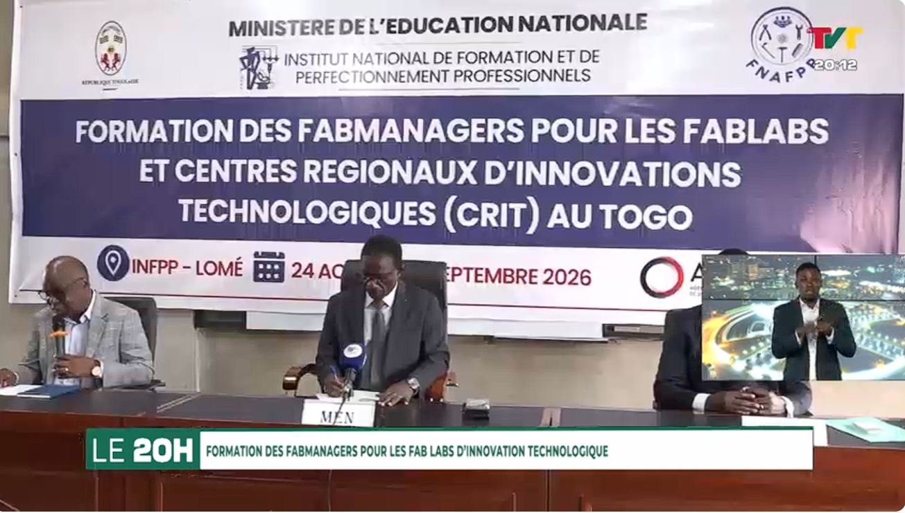

# Journal — Lundi 24 août 2026 (rédigé par : Daniel AFFO)

## Fait aujourd'hui

- [Céromonie d'ouverture avec le discours du ministre et des formateurs]

## Appris

1 La documentation  
2 Le langage Markdown  
3 Apprentissage et installations de quelques outils (VSCode, Git, Github )  
4 La journalisation des acquis
## Raté, puis corrigé

- RAS

## Décidé

- RAS
## À faire demain

- Création d'un dépôt et création des groupes de travail de 4 personnes
