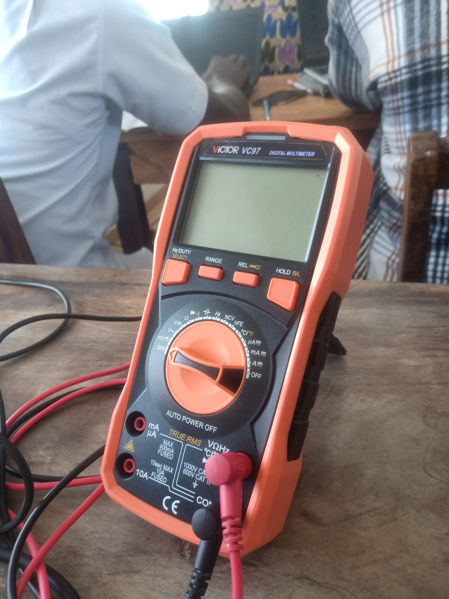
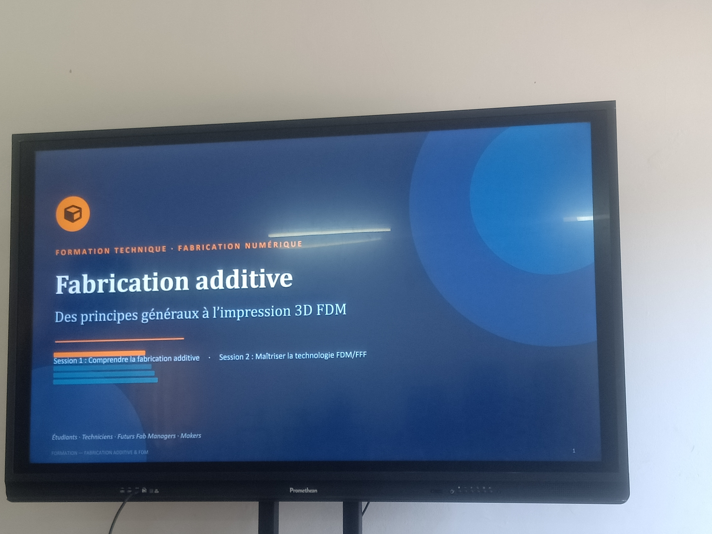

# Journal — Mercredi 26 août 2026 (rédigé par : Daniel AFFO)

## Fait aujourd'hui

- 1 Découpe Laser Généralités  
2 Bases de l'électronique  
3 Idées de projet
-   
- 

## Appris

1 Les différentes sortes de machines de découpe laser (CO2, laser, diode...)  
2  Les bases de l'électroniques (tension,intensité, résistance, multimètre)  
3 Généralités sur la modélisation et l'impression 3D
4 Idées de projet
## Raté, puis corrigé
RAS

## Décidé
RAS

## À faire demain

- Présentation du cahier de charges
- Approfondissement dans tous les modules
