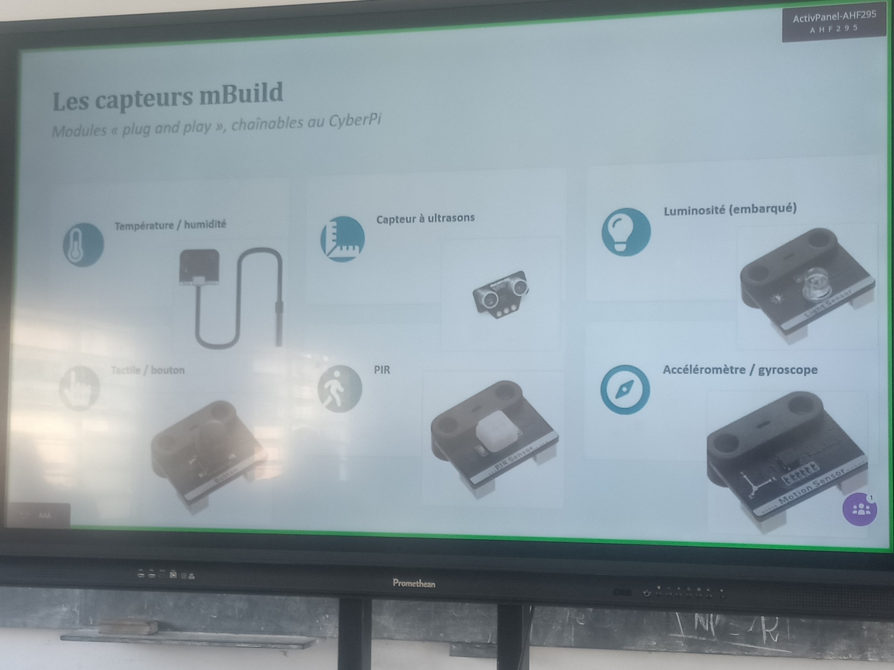
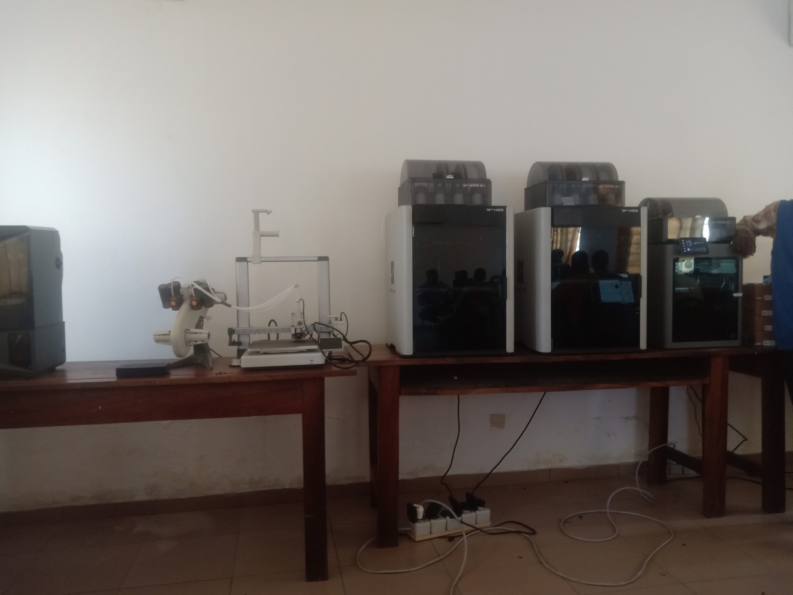

# Journal — Jeudi 27 août 2026 (rédigé par : Daniel AFFO)

## Fait aujourd'hui

- 1 Electronique  
2 Impression 3D  
3 Découpe Laser
-   
- 

## Appris

1 Electronique: Capteurs et actionneurs, application mblock  
2  Impression 3D: Applications Bambu studio et PrusaSlicer   
3 Découpe laser: utilisation de xtool 
4 Installation de l'application Autodesk Fusion
## Raté, puis corrigé
RAS

## Décidé
RAS

## À faire demain

- Présentation du cahier de charges
- Approfondissement dans tous les modules
