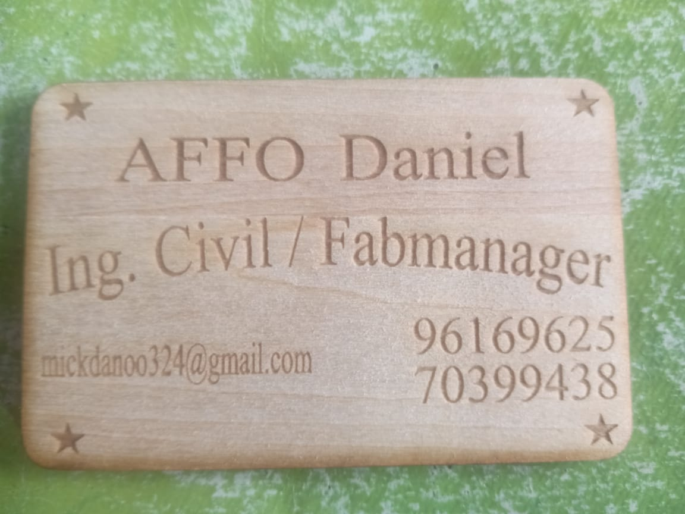

# Journal — Vendredi 28 août 2026 (rédigé par : Daniel AFFO)

## Fait aujourd'hui

- 1 Electronique  
2 Impression 3D  
3 Découpe Laser
-   
- 

## Appris

1 Electronique: réalisation d'un programme de lampadaire automatique avec l'application mblock  
2  Impression 3D: Modélisation 3D   
3 Découpe laser: Impression avec la machine Xtool P3  
4 Installation de l'application Autodesk Fusion puis présentation des étapes précédant un projet 
## Raté, puis corrigé
RAS

## Décidé
RAS

## À faire demain

- Présentation du cahier de charges
- Décision du projet à dévélopper par chaque groupe
