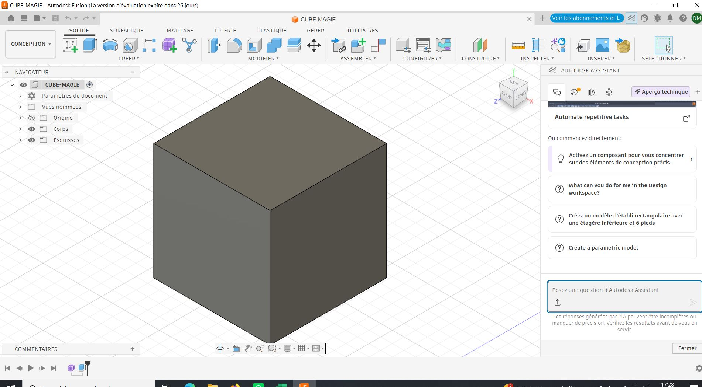

# Journal — Samedi 29 août 2026 (rédigé par : Daniel AFFO)

## Fait aujourd'hui

- 1 Validation des projets à chaque groupe de travail, réalisation de la fiche de projet et la liste des besoins du projet
-   

## Appris

- Bases du logiciel autodesk fusion 3D
## Raté, puis corrigé
RAS

## Décidé
RAS

## À faire demain
Modélisation 3D

