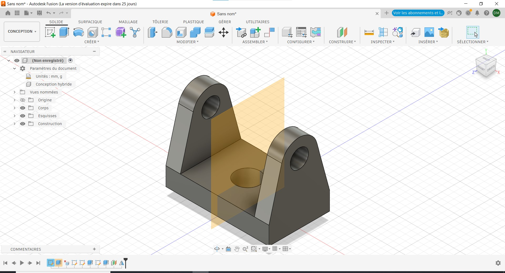

# Journal — Mardi 01 Septembre 2026 (rédigé par : Daniel AFFO)

## Fait aujourd'hui

- 1 Utilisation du logiciel Autodesk Fusion 360 pour la modélisation  
2 La breadboard SK10
-   
-   

## Appris

- Modélisation avec le logiciel autodesk fusion 3D
- Utilisation de la plaquette SK10 pour les connexions 
## Raté, puis corrigé
RAS

## Décidé
RAS

## À faire demain
Suite des programmes

