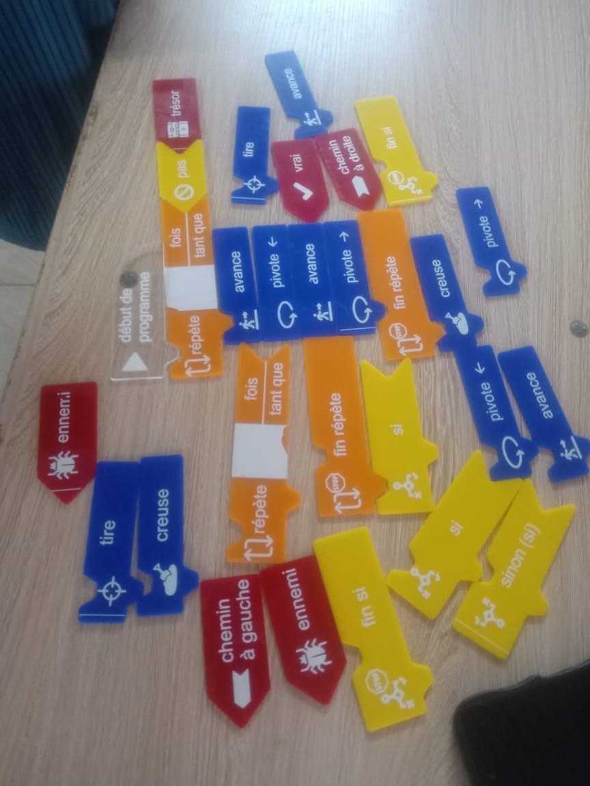
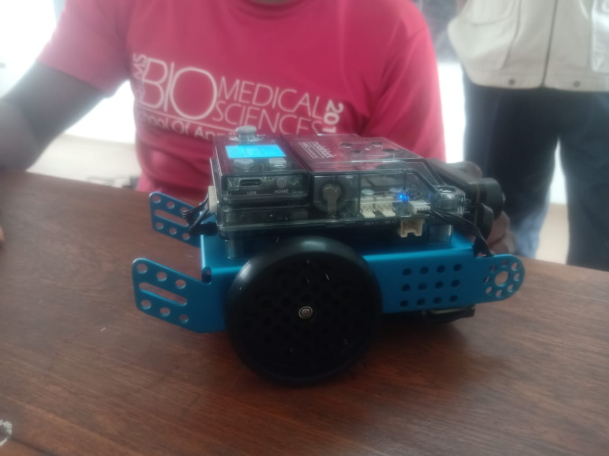
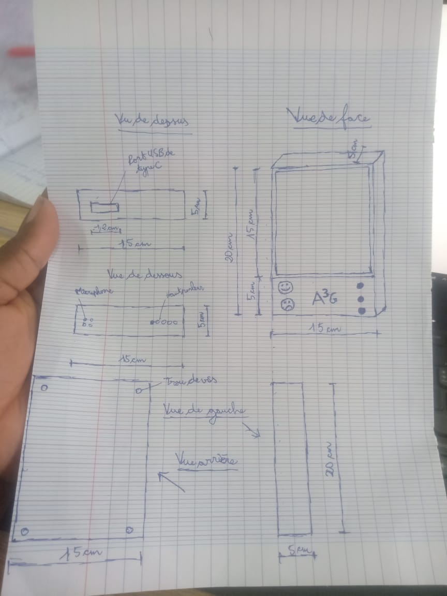

# Journal — Mardi 01 Septembre 2026 (rédigé par : Daniel AFFO)

## Fait aujourd'hui

- 1 Assemblage d'un mini-robot dans l'atelier d'électronique  
2 Notions de base sur l'algorithme  
3 Début des projets et définition des étapes
-   
-   
-   

## Appris

- Assemblage de robot électronique 
- Définitions de l'algorithme 
## Raté, puis corrigé
RAS

## Décidé
RAS

## À faire demain
Suite des programmes

