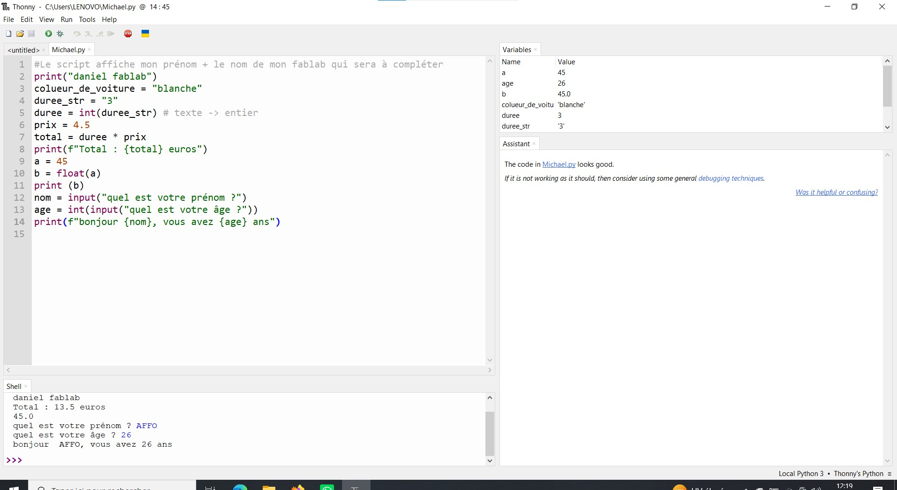

# Journal — Mardi 01 Septembre 2026 (rédigé par : Daniel AFFO)

## Fait aujourd'hui

- 1 Notions de base sur la programmation  
 2 Suite des projets et définition des étapes
-   
- 

## Appris

- Définition des étapes des projets de groupe et dispatch des tâches entre les membres du groupe
- Début du langage Python 
## Raté, puis corrigé
RAS

## Décidé
RAS

## À faire demain
Suite des programmes

