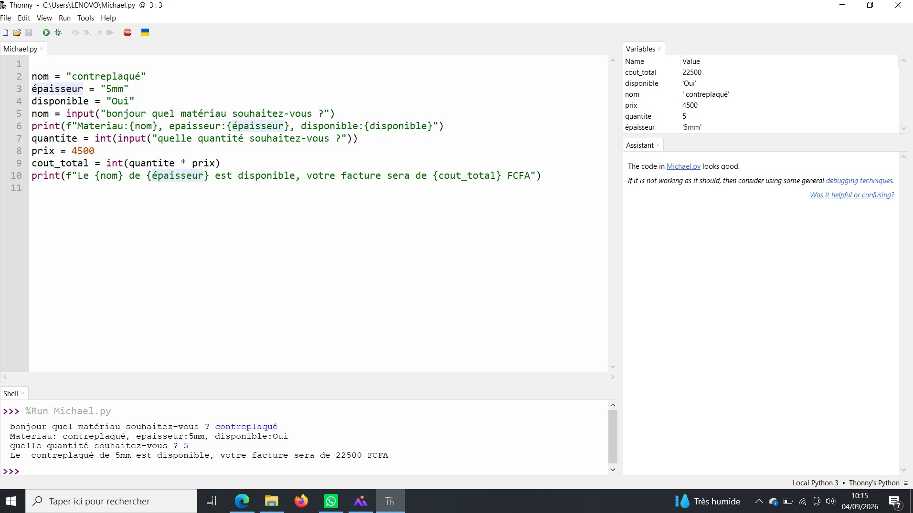
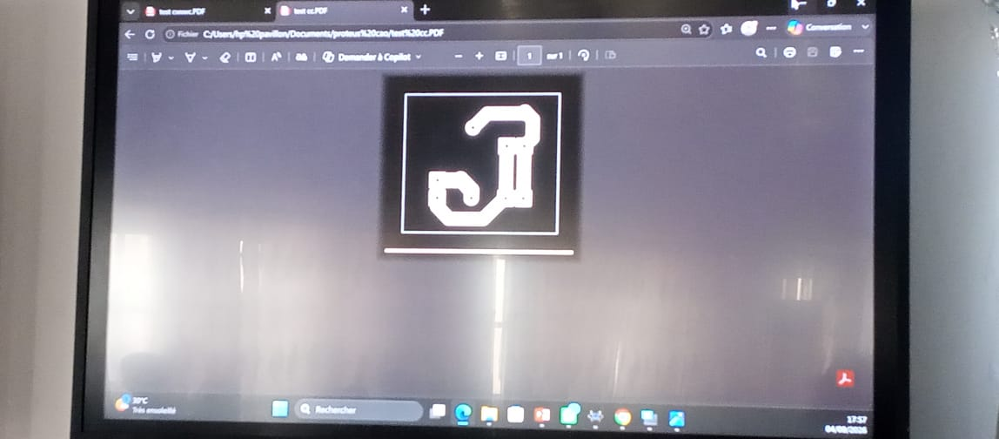

# Journal — Mardi 01 Septembre 2026 (rédigé par : Daniel AFFO)

## Fait aujourd'hui

- 1 Notions de base sur la programmation et l'électronique  
2 Modélisation 3D
-   
- 

## Appris

- Circuits imprimés
- Langage Python (suite) 
## Raté, puis corrigé
RAS

## Décidé
RAS

## À faire demain
Suite des programmes

