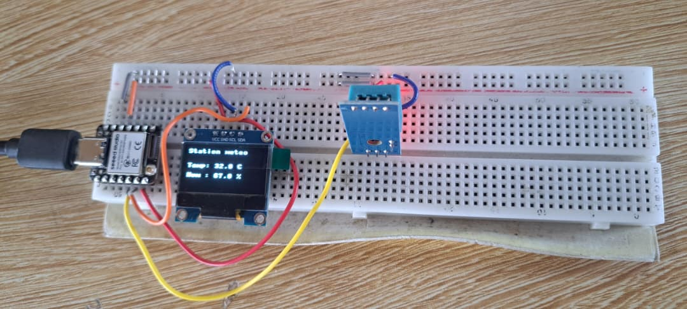
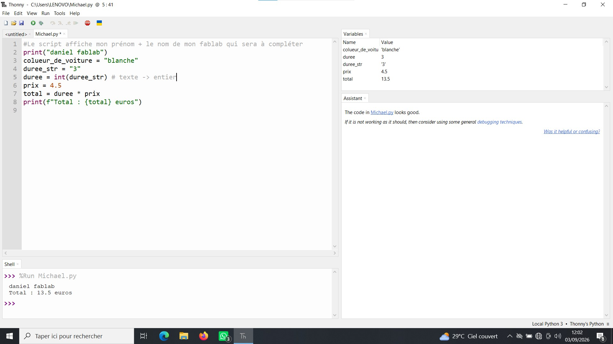

# Journal — Mardi 01 Septembre 2026 (rédigé par : Daniel AFFO)

## Fait aujourd'hui

- 1 Notions de base sur la programmation et l'électronique  
2 Réalisation d'un circuit sur la breadboard
-   
- 

## Appris

- Réalisation d'un circuit avec la breadboard (mini station météo)
- Importation d'un code sur le XIAO ESP32 S3 avec le logiciel Thonny 
## Raté, puis corrigé
RAS

## Décidé
RAS

## À faire demain
Suite des programmes

