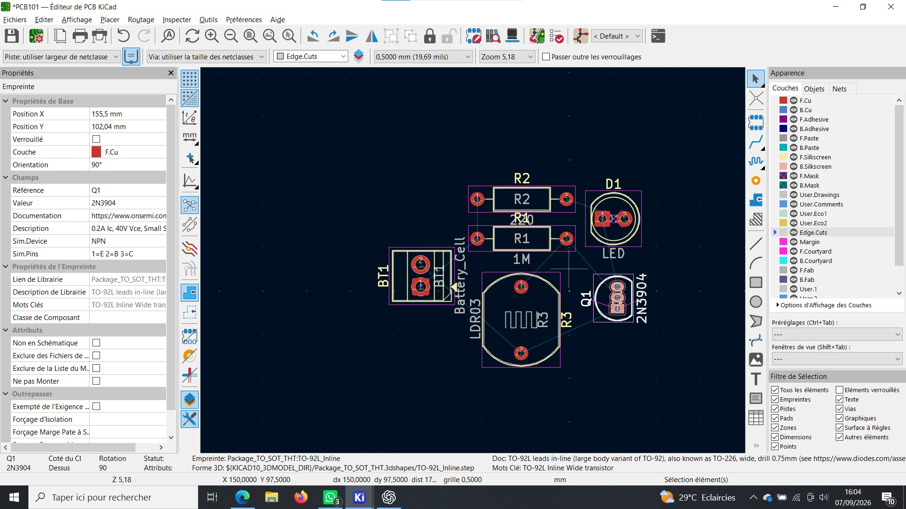
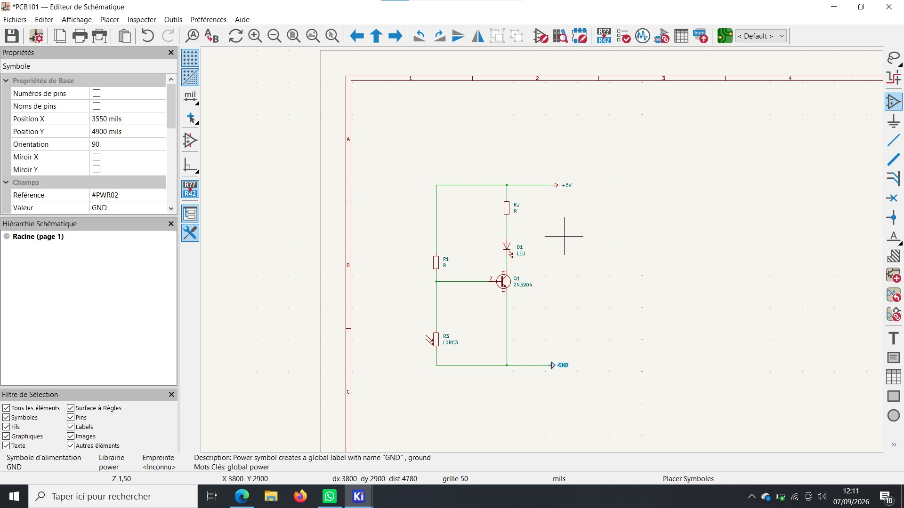

# Journal — Mardi 01 Septembre 2026 (rédigé par : Daniel AFFO)

## Fait aujourd'hui

- 1 Notions sur l'électronique  
-   
- 

## Appris

- Réalisation d'un circuit numérique avec le logiciel kicad (image 2D et 3D)
## Raté, puis corrigé
RAS

## Décidé
RAS

## À faire demain
Suite des programmes

