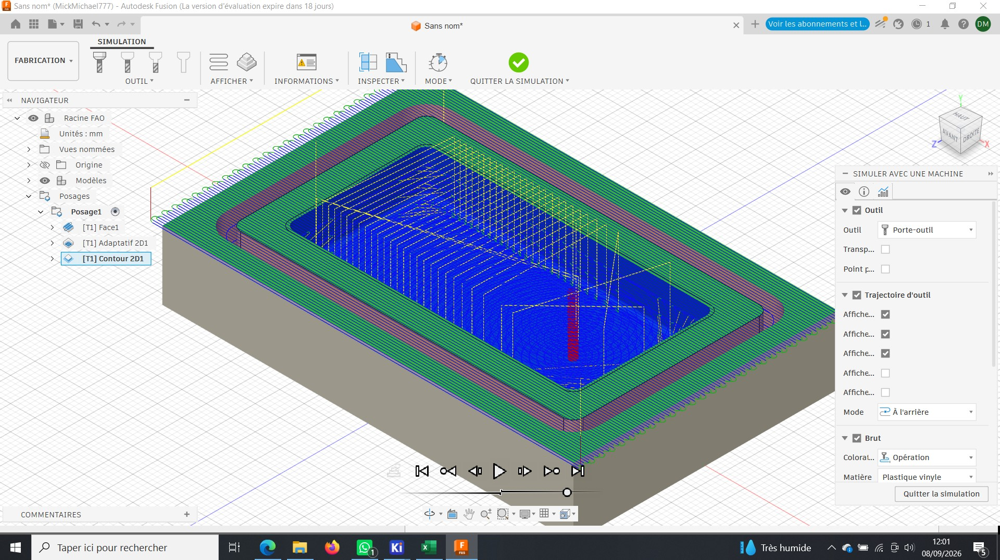
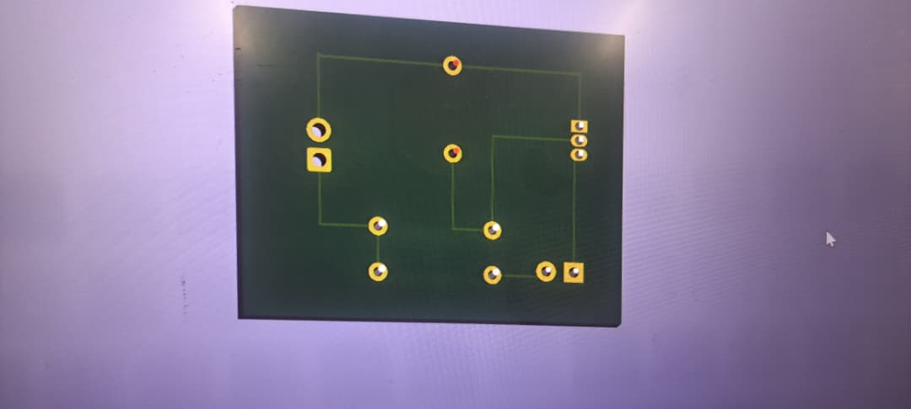

# Journal — Mardi 01 Septembre 2026 (rédigé par : Daniel AFFO)

## Fait aujourd'hui

- 1 Notions sur la FAO 
-   
- 

## Appris

- Utilisation du logiciel Fusion pour la FAO soustractive avec la CNC
## Raté, puis corrigé
RAS

## Décidé
RAS

## À faire demain
Suite des programmes

