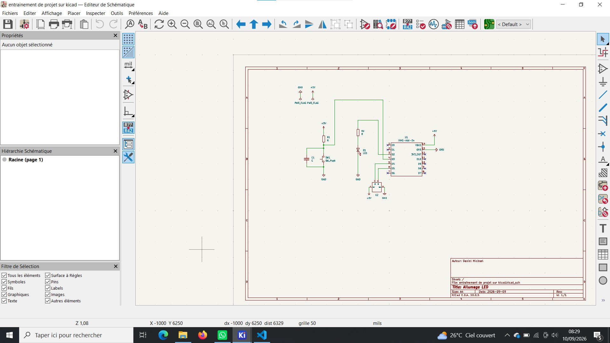
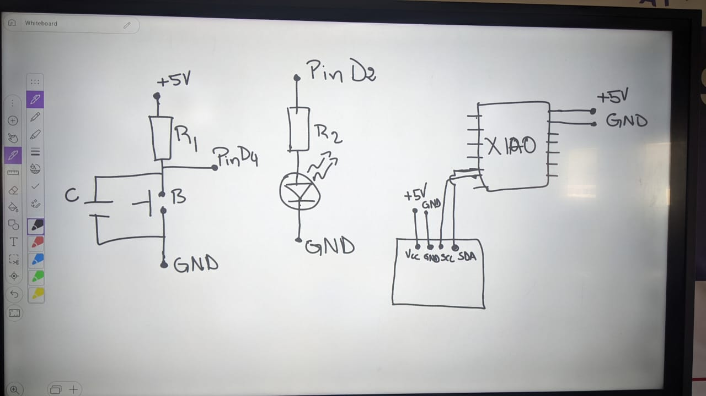
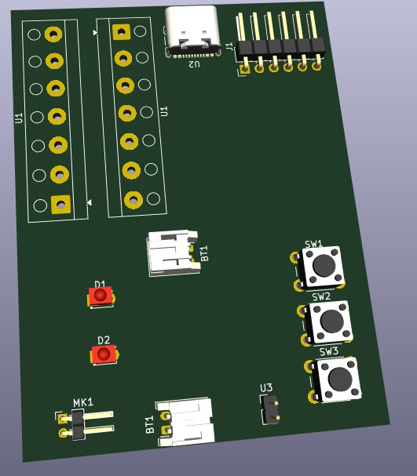
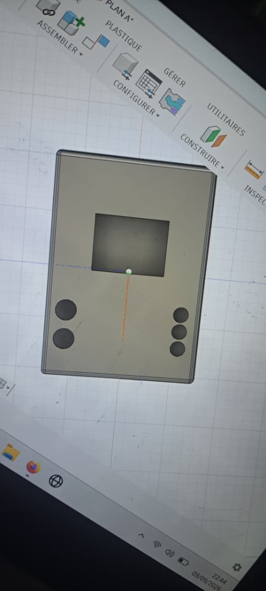

# Journal — Mercredi 09 Septembre 2026 (rédigé par : Daniel AFFO)

## Fait aujourd'hui

- 1 Réalisation d'un projet
-   
- 
- 
- 

## Appris

- Utilisation du logiciel Kicad pour la réalisation de la PCB  
- Début de codage   
- Evolution sur le projet du groupe 12: Robot Compagnon de Lecture
## Raté, puis corrigé
RAS

## Décidé
RAS

## À faire demain
Suite des programmes

