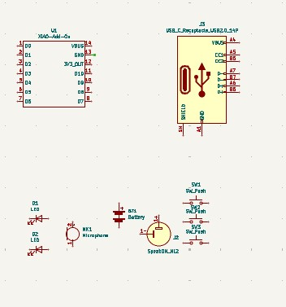
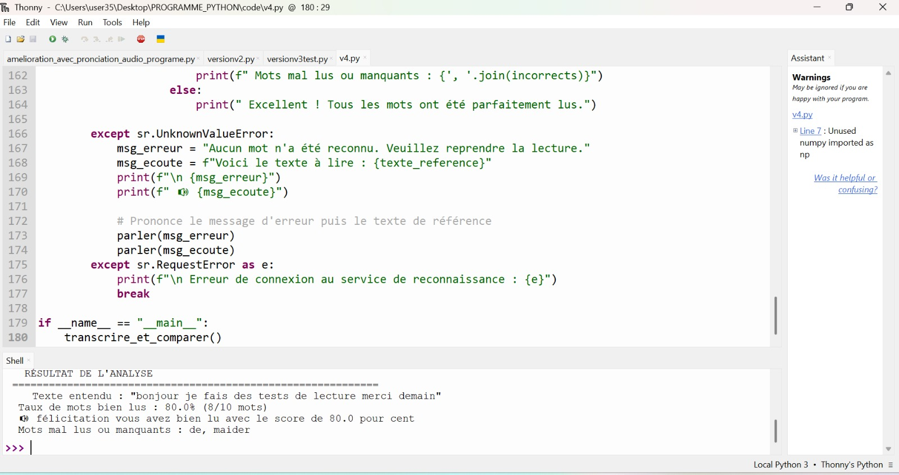

# Journal — Jeudi 10 Septembre 2026 (rédigé par : Daniel AFFO)

## Fait aujourd'hui

- 1 Avancement dans les projets de groupe avec l'assistance des encadreurs  
 - Evolution sur le projet du groupe 12: Robot Compagnon de Lecture
-   
- 
- 
- 

## Appris

- Utilisation du logiciel Kicad pour la réalisation de la PCB  
- Quelques codes simples sur thonny   

## Raté, puis corrigé
RAS

## Décidé
RAS

## À faire demain
Suite des programmes

