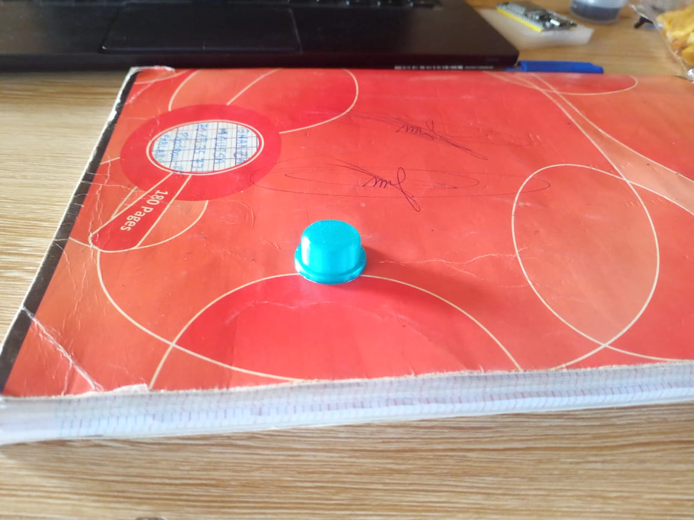

# Journal — Vendredi 11 Septembre 2026 (rédigé par : Daniel AFFO)

## Fait aujourd'hui

- 1 Avancement dans les projets de groupe avec l'assistance des encadreurs  
 - Evolution sur le projet du groupe 12: Robot Compagnon de Lecture
-   
- 

## Appris

- Modélisation et impression 3D d'un couvre bouton poussoir
- Quelques codes simples sur thonny et test du code du projet 

## Raté, puis corrigé
RAS

## Décidé
RAS

## À faire demain
Suite des programmes

