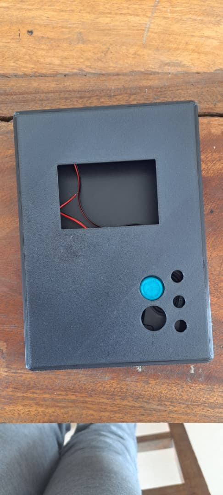
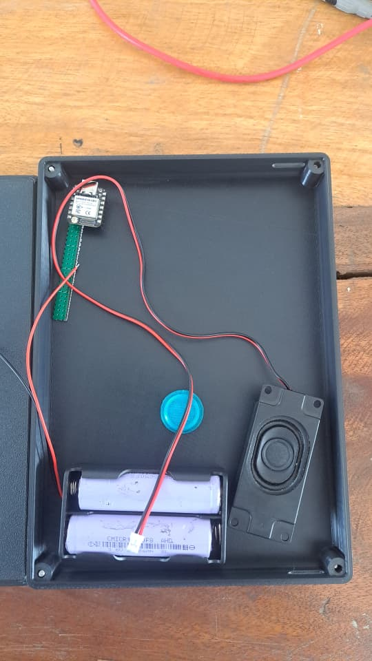

# Journal — Samedi 12 Septembre 2026 (rédigé par : Daniel AFFO)

## Fait aujourd'hui

- 1 Avancement dans les projets de groupe avec l'assistance des encadreurs  
 - Evolution sur le projet du groupe 12: Robot Compagnon de Lecture
-   
- 
- 

## Appris

- Modélisation et impression 3D du boîtier du robot
- Test du code du projet avec les composants 

## Raté, puis corrigé
- Le PC ne reconnaissait pas l'ESP32, on a dû le flasher en installant un pilote de reconnaissance

## Décidé
RAS

## À faire demain
Suite des programmes

