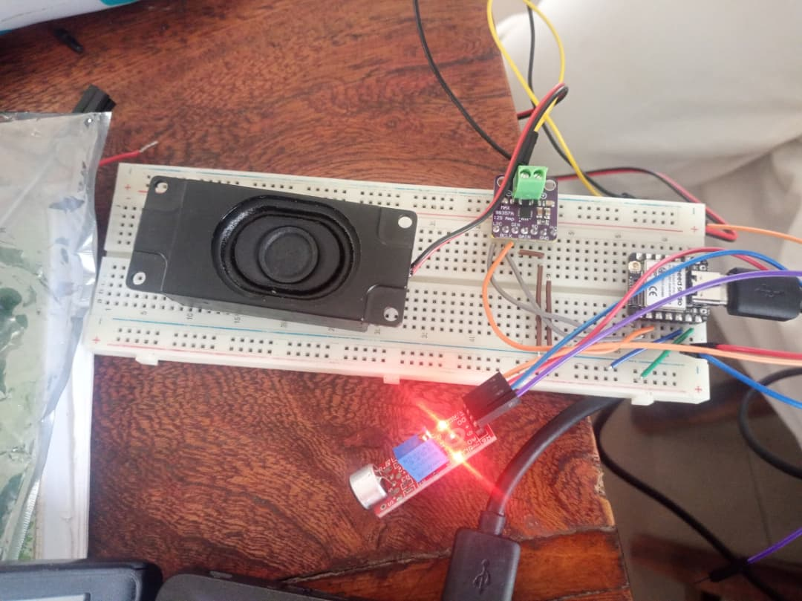
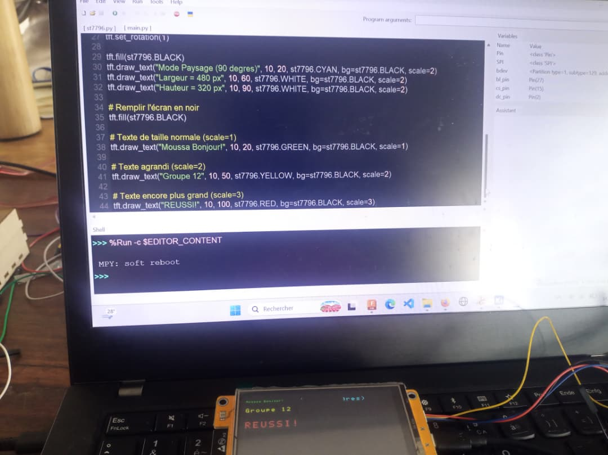
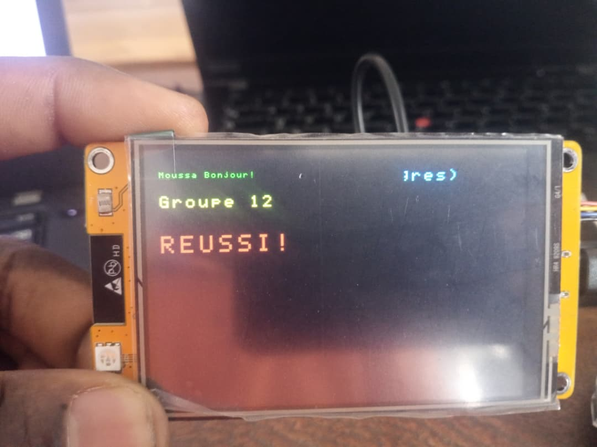

# Journal — Lundi 14 Septembre 2026 (rédigé par : Daniel AFFO)

## Fait aujourd'hui

- 1 Avancement dans les projets de groupe avec l'assistance des encadreurs  
 - Evolution sur le projet du groupe 12: Robot Compagnon de Lecture
-   
- 
- 

## Appris

- Test du circuit du projet avec certaines composantes (écran tft, haut-parleur, amplificateur)
- Test du code pour l'affichage avec l'écran tft 

## Raté, puis corrigé

## Décidé
RAS

## À faire demain
Suite des programmes

