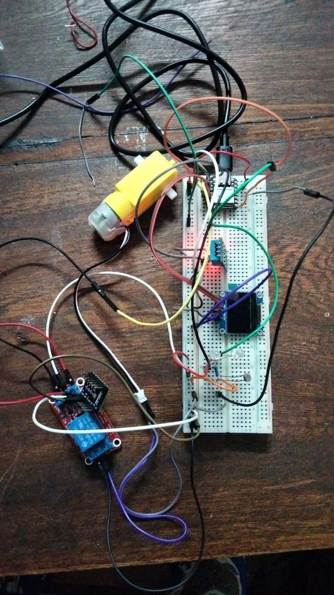
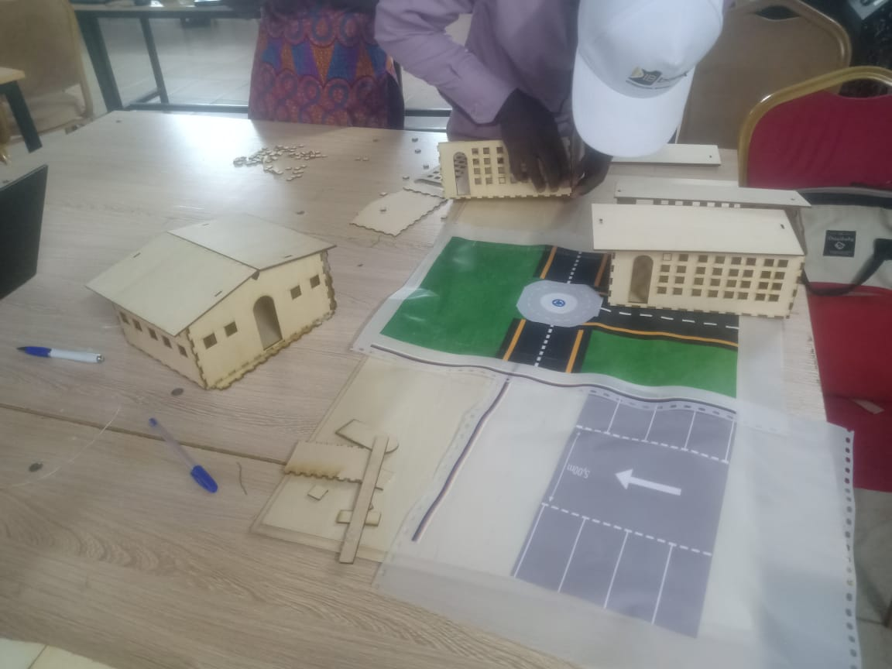
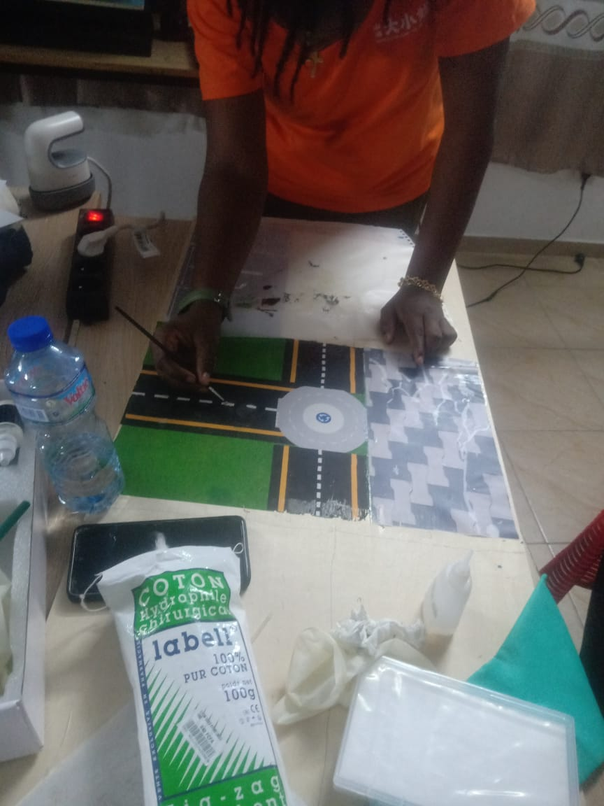

# Journal — Mercredi 15 Septembre 2026 (rédigé par : Daniel AFFO)

## Fait aujourd'hui

- 1 Avancement dans les projets de groupe avec l'assistance des encadreurs  
 - Changement de projet du groupe 12: Maquette d'un petit lycée scientifique moderne
-   
- 
- 

## Appris

## Raté, puis corrigé

## Décidé
Compte tenu du temps imparti nous avons décider d'achever notre projet après la formation, et nous avons pris un autre projet à présenter à l'échéance

## À faire demain
Suite des programmes

