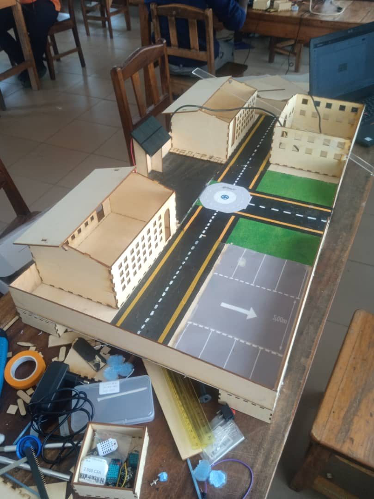
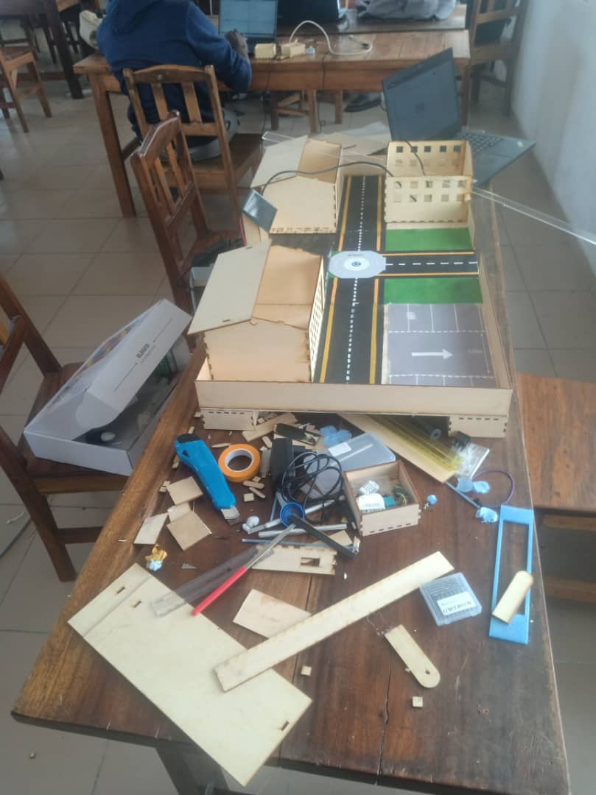

# Journal — Jeudi 17 Septembre 2026 (rédigé par : Daniel AFFO)

## Fait aujourd'hui

- 1 Avancement dans les projets de groupe avec l'assistance des encadreurs  
 - Evolution sur le nouveau projet du groupe 12: Maquette d'un petit lycée scientifique 
-   
- 

## Appris
 
## Raté, puis corrigé

## Décidé
RAS

## À faire demain
Suite des programmes

